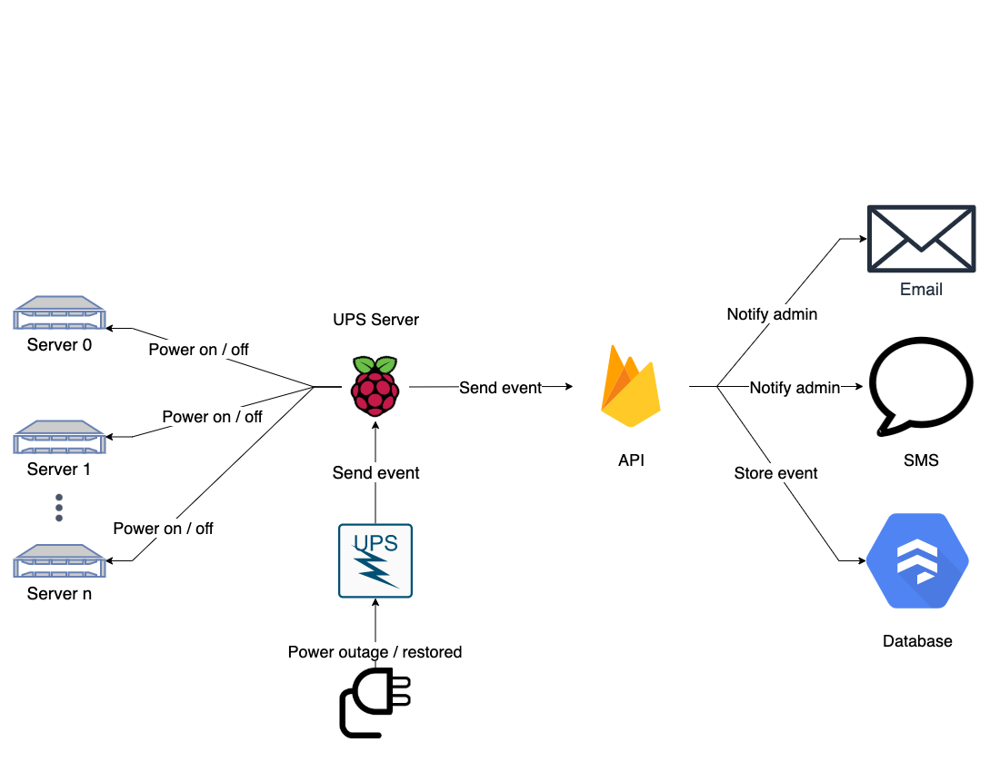

# Home Automation
This project contains source code used for home automation.

## UPS Monitoring
A UPS (Uninterrupted Power Supply) is a device that acts as a backup power supply
in the event that the "line" electricity is lost. The UPS plugs directly into
the line (wall outlet), and devices are then connected to the UPS. That way, if power is lost,
the go uninterrupted (hence the name UPS) - until the UPS runs out of
battery of course. Monitoring these events can allow us to do the following (before the battery is depleted):



1. Detect an event such as an outage or restoration of power.
2. Notify the owner of the event and the status of the UPS (charge %, load %, et al).
3. Gracefully shut down our devices during outage, and power them back on when power is restored.

## Cloud Function Setup
Execute the following commands to run the API locally:

```bash
git clone https://github.com/jabaridash/home-automation.git
cd home-automation/functions
npm install
firebase login
firebase emulators:start --only functions
```

This assumes you have the Firebase CLI installed locally.

To get the environment from production:

```
firebase functions:config:get
```

This can also be stored into a file. If Firebase detects a `runtimeconfig.json` locally, it will be used
as the config. Here you can override configuration. If the file is not present, the production file will
be used.

```
firebase functions:config:get > .runtimeconfig.json
```

## Run Python script locally
